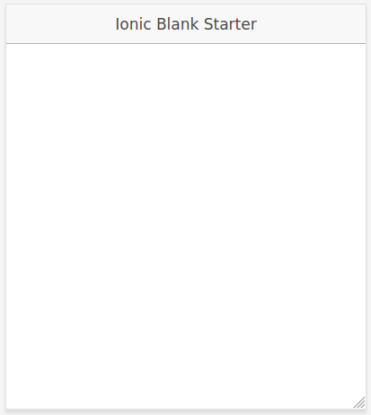

# Soluciones a los ejercicios 1, 2, 3 y 4 del capítulo 1

## Ejercicio 1

### Creación de un proyecto en Ionic Versión 1 (con AngularJS)

Antes de nada, hay que instalar Python 2 en caso de no tenerlo instalado en el sistema, aunque tengamos instalada una versión más reciente como por ejemplo Python 3.

```console
sudo apt install python2
```

Creamos un proyecto en blanco:

```console
ionic start exercise01a blank --type=ionic1
```

La creación del proyecto podría provocar errores relativos al CSS. En tal caso, habría que instalar `node-sass`, borrar el directorio `node_modules` y actualizar las dependencias: 

```console
cd exercise01a
npm install node-sass
rm -Rf node_modules
npm install
```

No sería de extrañar que se siguieran produciendo errores. Ionic 1 ya es muy antiguo y hace uso de librerías obsoletas. Esto no va a afectar en ningún modo a los proyectos que realicemos con versiones modernas de este framework. 

Si el proyecto se ha creado correctamente, se puede lanzar el servidor:

```console
ionic serve
```



Estructura de directorios y ficheros:

```console
exercise01a
├── bower.json
├── gulpfile.js
├── hooks
│   ├── after_prepare
│   └── README.md
├── ionic.config.json
├── ionic.starter.json
├── node_modules
│   │
.   .
.   .
.   .
├── package.json
├── package-lock.json
├── scss
│   └── ionic.app.scss
└── www
    ├── css
    ├── img
    ├── index.html
    ├── js
    ├── lib
    ├── manifest.json
    └── service-worker.js
```

### Creación de un proyecto en Ionic Versión 3 (con Angular)

```console

```

Estructura de directorios y ficheros:

```console

```

### Creación de un proyecto en Ionic Versión 4 o posterior (con Angular)

```console

```

Estructura de directorios y ficheros:

```console

```

## Ejercicio 2

```console

```

## Ejercicio 3

```console

```

## Ejercicio 4

```console

```
