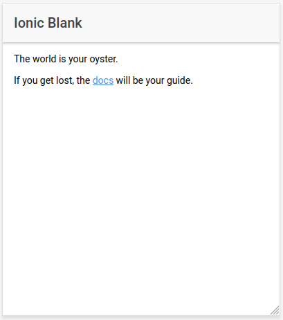
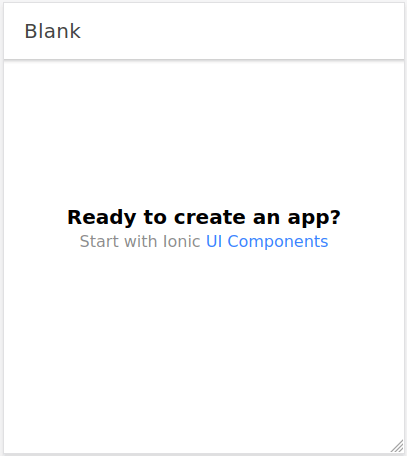
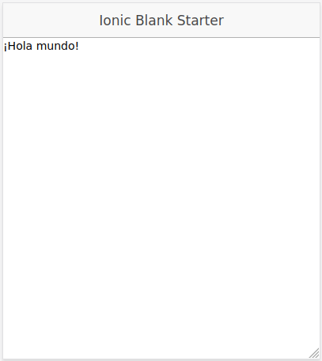
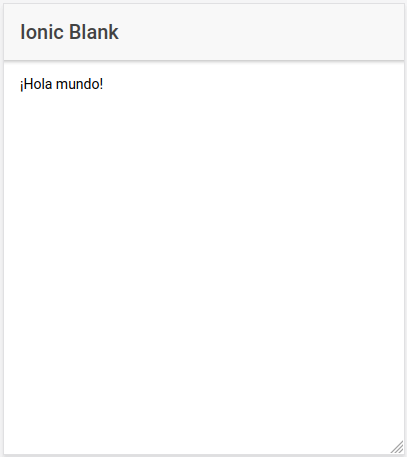
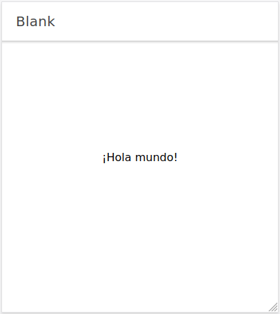

# Soluciones a los ejercicios 1, 2, 3 y 4 del capítulo 1

<a href="https://leanpub.com/aprendeionic">
    
</a>

## Índice

* [Ejercicio 1](#ejercicio-1)
* [Ejercicio 2](#ejercicio-2)
* [Ejercicio 3](#ejercicio-3)
* [Ejercicio 4](#ejercicio-4)

## Ejercicio 1

### Creación de un proyecto en Ionic Versión 1 (con AngularJS)

Antes de nada, hay que instalar Python 2 en caso de no tenerlo instalado en el sistema, aunque tengamos instalada una versión más reciente como por ejemplo Python 3.

```console
sudo apt install python2
```

Creamos un proyecto en blanco:

```console
ionic start exercise01a blank --type=ionic1
```

La creación del proyecto podría provocar errores relativos al CSS. En tal caso, habría que instalar `node-sass`, borrar el directorio `node_modules` y actualizar las dependencias: 

```console
cd exercise01a
npm install node-sass
rm -Rf node_modules
npm install
```

No sería de extrañar que se siguieran produciendo errores. Ionic 1 ya es muy antiguo y hace uso de librerías obsoletas. Esto no va a afectar en ningún modo a los proyectos que realicemos con versiones modernas de este framework. 

Si el proyecto se ha creado correctamente, se puede lanzar el servidor:

```console
ionic serve
```


Estructura de directorios y ficheros:

```console
exercise01a
├── bower.json
├── gulpfile.js
├── hooks
│   ├── after_prepare
│   └── README.md
├── ionic.config.json
├── ionic.starter.json
├── node_modules
│   │
.   .
.   .
.   .
├── package.json
├── package-lock.json
├── scss
│   └── ionic.app.scss
└── www
    ├── css
    ├── img
    ├── index.html
    ├── js
    ├── lib
    ├── manifest.json
    └── service-worker.js
```

Como se puede observar, en un proyecto de la versión 1 de Ionic, el grueso de la aplicación está en la carpeta `www`. Dentro de ese directorio está `index.html` que hace las veces de plantilla HTML.

La lógica de negocio estaría contenida dentro de la carpeta `js`, los estilos en la carpeta `css` y las imágenes en `img`.

Se trata de una estructura muy simple, parecida a lo que sería un proyecto de HTML con Javascript sin ningún framework.

**En Ionic 1 se utiliza AngularJS** (versión 1.X). Cuando se liberó esta versión de Ionic, todavía no existía **Angular** a secas (versión 2+), por tanto, la lógica de negocio se programaba directamente en Javascript.

### Creación de un proyecto en Ionic Versión 3 (con Angular)

Creación del proyecto:

```console
ionic start exercise01b blank --type=ionic-angular
```



Estructura de directorios y ficheros:

```console
exercise01b
├── ionic.config.json
├── node_modules
.   .
.   .
.   .
├── package.json
├── package-lock.json
├── src
│   ├── app
│   ├── assets
│   ├── index.html
│   ├── manifest.json
│   ├── pages
│   ├── service-worker.js
│   └── theme
├── tsconfig.json
├── tslint.json
└── www
    ├── assets
    ├── build
    ├── index.html
    ├── manifest.json
    └── service-worker.js
```

Como podemos comprobar, hay más diferencias que similitudes en la estructura de directorios de un proyecto de la versión 2/3 con respecto a otro de la versión 1.

En esta versión, el código fuente de la aplicación está en la carpeta `src` mientras que en la carpeta `www` se colocará el código de la aplicación una vez compilada, lista para su despliegue.

Si indagamos un poco dentro del directorio `app` o en `pages` (donde se encuentra la página principal que viene por defecto) encontraremos archivos con la extensión `.ts`. Estos archivos contienen código en **Typescript**, lo que nos da una pista que nos indica que estamos ya ante un proyecto en el que se usa **Angular** y no **AngularJS**.

### Creación de un proyecto en Ionic Versión 4 o posterior (con Angular)

Creación del proyecto:

```console
ionic start exercise01c blank --type=angular
```



Estructura de directorios y ficheros:

```console
exercise01c
├── angular.json
├── browserslist
├── e2e
│   ├── protractor.conf.js
│   ├── src
│   └── tsconfig.json
├── ionic.config.json
├── karma.conf.js
├── node_modules
│   ├── abab
.   .
.   .
.   .
│   └── zone.js
├── package.json
├── package-lock.json
├── src
│   ├── app
│   ├── assets
│   ├── environments
│   ├── global.scss
│   ├── index.html
│   ├── main.ts
│   ├── polyfills.ts
│   ├── test.ts
│   ├── theme
│   └── zone-flags.ts
├── tsconfig.app.json
├── tsconfig.json
├── tsconfig.spec.json
└── tslint.json
```

En la versión 4+, a primera vista, hay más carpetas y archivos que en la versión 2/3.

Desaparece la carpeta `www` por defecto. Esta carpeta y su contenido se generará cuando se compile la aplicación con `ionic build`.

La carpeta `pages` también desaparece en esta versión, aunque se puede crear manualmente para guardar las páginas de la aplicación si se quiere.

## Ejercicio 2

### Hola mundo en Ionic 1

`www/index.html`

```html
<!DOCTYPE html>
<html>
  <head>
    <meta charset="utf-8">
    <meta name="viewport" content="initial-scale=1, maximum-scale=1, user-scalable=no, width=device-width">
    <title></title>

    <link rel="manifest" href="manifest.json">

    <!-- un-comment this code to enable service worker
    <script>
      if ('serviceWorker' in navigator) {
        navigator.serviceWorker.register('service-worker.js')
          .then(() => console.log('service worker installed'))
          .catch(err => console.log('Error', err));
      }
    </script>-->

    <link href="lib/ionic/css/ionic.css" rel="stylesheet">
    <link href="css/style.css" rel="stylesheet">

    <!-- IF using Sass (run gulp sass first), then uncomment below and remove the CSS includes above
    <link href="css/ionic.app.css" rel="stylesheet">
    -->

    <!-- ionic/angularjs js -->
    <script src="lib/ionic/js/ionic.bundle.js"></script>

    <!-- cordova script (this will be a 404 during development) -->
    <script src="cordova.js"></script>

    <!-- your app's js -->
    <script src="js/app.js"></script>
  </head>
  <body ng-app="starter">

    <ion-pane>
      <ion-header-bar class="bar-stable">
        <h1 class="title">Ionic Blank Starter</h1>
      </ion-header-bar>
      <ion-content>
        ¡Hola mundo!
      </ion-content>
    </ion-pane>
  </body>
</html>
```



### Hola mundo en Ionic 2/3

`src/app/pages/home/home.html`

```html
<ion-header>
  <ion-navbar>
    <ion-title>
      Ionic Blank
    </ion-title>
  </ion-navbar>
</ion-header>

<ion-content padding>
  ¡Hola mundo!
</ion-content>
```



### Hola mundo en Ionic 4+

`src/app/home/home.page.html`

```html
<ion-header [translucent]="true">
  <ion-toolbar>
    <ion-title>
      Blank
    </ion-title>
  </ion-toolbar>
</ion-header>

<ion-content [fullscreen]="true">
  <div id="container">
    ¡Hola mundo!
  </div>
</ion-content>
```



## Ejercicio 3

```console

```

## Ejercicio 4

```console

```

<hr>

:star: Si te ha gustado este repo, dale una estrellita :wink:
